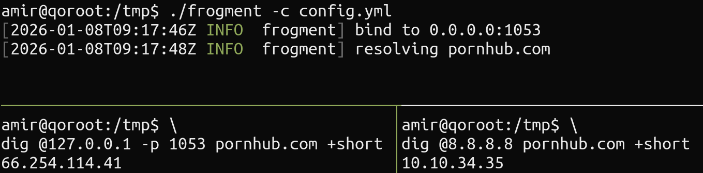

<h1 align="center">
  
  <br>frogment<br>
</h1>

a DNS resolver that fragments domain names in DNS packets using [RFC 1035](https://datatracker.ietf.org/doc/html/rfc1035#section-4.1.4) compression pointers to bypass gfw dns poisoning.

## Usage
```sh
$ frogment --config ./example-config.toml
```

## Demo

